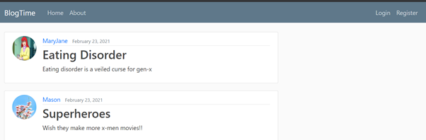
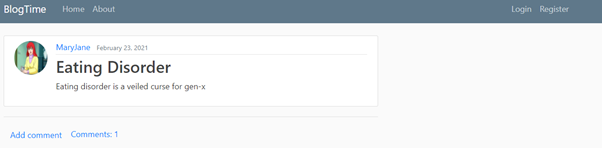
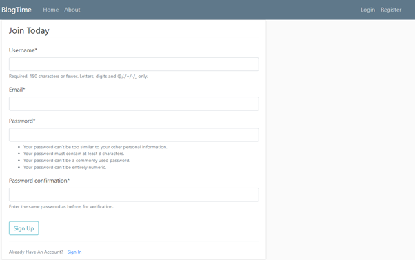
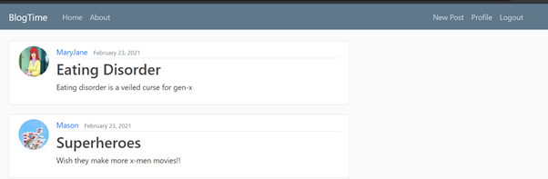
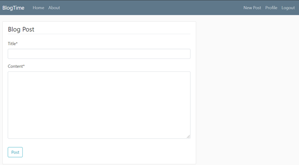
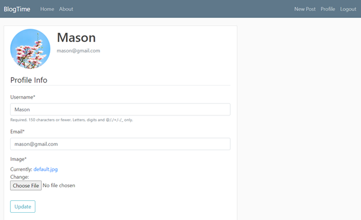

# Blogtime
Blog time is blogging application that allows user to register and post blogs and also allows registered users to comment on different blog posts. Users also has the priviledge to update or delete a blog post
and can delete any comments that they do not want to see underneath their posts.

## Technology used:

1) Django framework has been used to build the project.
2) Programming language used : Python 3.6
3) Editor: Visual Studio Code.

## HOME:

The home page of the blogging site shows the different posts that have been made by the users. It also shows how many comments each of the posts have acquired once a post is selected.
First-time users can register into the application. Already registered users can sign in into their account. It also shows the user the 'about' section of the blog.The following picture shows the home page.
   

## Registration:

This page allows first time users to sign up. It also enables already existing users to login into their account.

## User Account:

Once a user logs into the profile he will be redirected to the home page. He can also create new post by clicking 'New Post'.

## New Post
This page allows the user to add new posts.

## Profile
This is the profile page of the user where the user can update his username, email id as well as upate his profile picture.

                

